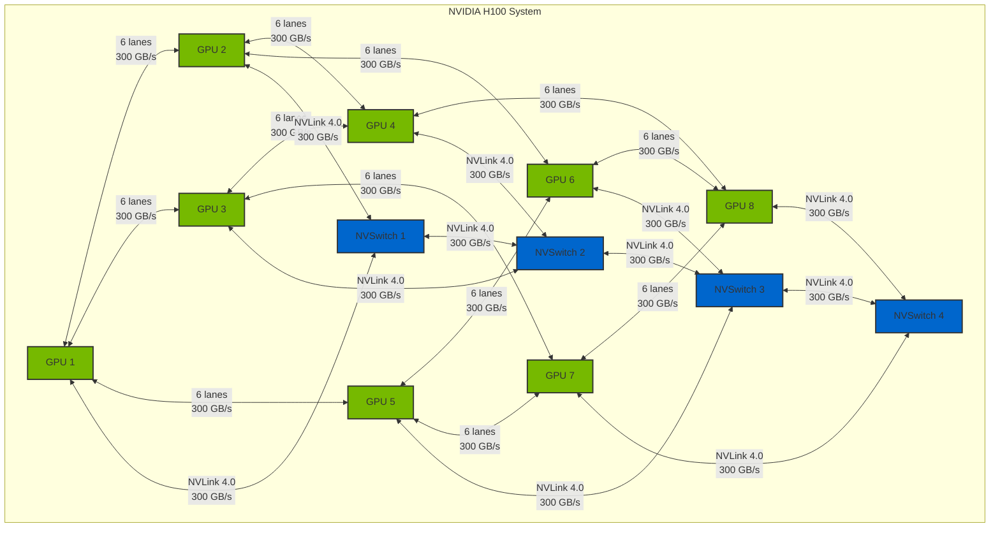

# NVIDIA H100 NVLink Topology

## Style Definitions

The following class definitions can be reused across all H100 system diagrams for consistent styling:

```mermaid
%%{init: {'theme': 'base', 'themeVariables': { 'fontSize': '16px'}}}%%
classDef gpu fill:#76b900,stroke:#333,stroke-width:2px,color:#fff,font-weight:bold
classDef nvswitch fill:#0066cc,stroke:#333,stroke-width:2px,color:#fff,font-weight:bold
classDef cpu fill:#ff9900,stroke:#333,stroke-width:2px,color:#fff,font-weight:bold
classDef memory fill:#66ccff,stroke:#333,stroke-width:2px,color:#000,font-weight:bold
classDef storage fill:#663399,stroke:#333,stroke-width:2px,color:#fff,font-weight:bold
classDef pcie fill:#666666,stroke:#333,stroke-width:2px,color:#fff,font-weight:bold
classDef infiniband fill:#cc0000,stroke:#333,stroke-width:2px,color:#fff,font-weight:bold
classDef ethernet fill:#990000,stroke:#333,stroke-width:2px,color:#fff,font-weight:bold
classDef cache fill:#ff9966,stroke:#333,stroke-width:2px,color:#000,font-weight:bold
classDef nvlink stroke:#0066cc,stroke-width:2px,color:#0066cc,font-weight:bold
classDef pcie_link stroke:#666666,stroke-width:2px,color:#666666,font-weight:bold
classDef memory_link stroke:#66ccff,stroke-width:2px,color:#66ccff,font-weight:bold
classDef network_link stroke:#cc0000,stroke-width:2px,color:#cc0000,font-weight:bold

class GPU1,GPU2,GPU3,GPU4,GPU5,GPU6,GPU7,GPU8 gpu
class NVSwitch1,NVSwitch2,NVSwitch3,NVSwitch4 nvswitch
```

### Color Palette
- GPU: NVIDIA Green (#76b900)
- NVSwitch: Blue (#0066cc)
- CPU: Orange (#ff9900)
- Memory: Light Blue (#66ccff)
- Storage: Purple (#663399)
- PCIe: Gray (#666666)
- InfiniBand: Red (#cc0000)
- Ethernet: Dark Red (#990000)
- Cache: Light Orange (#ff9966)

### Font Styles
- All components use bold font weight
- White text on dark backgrounds
- Black text on light backgrounds
- Connection labels use matching colors

This diagram illustrates the NVLink connections between GPUs in an NVIDIA H100 system. The H100 uses NVLink 4.0, which provides high-speed GPU-to-GPU communication.



## Key Features

- Each H100 GPU has 18 NVLink 4.0 lanes
- Each NVLink 4.0 lane provides 50 GB/s bandwidth
- Each GPU-to-GPU connection uses 6 lanes (300 GB/s)
- Total NVLink bandwidth of up to 900 GB/s per GPU
- Full mesh topology for optimal communication
- Direct GPU-to-GPU communication without CPU intervention
- Support for up to 8 GPUs in a single system
- 4x NVSwitches for enhanced connectivity and bandwidth

## Connection Details

### Direct GPU-to-GPU Connections
- GPU1 ↔ GPU2, GPU3, GPU5
- GPU2 ↔ GPU4, GPU6
- GPU3 ↔ GPU4, GPU7
- GPU4 ↔ GPU8
- GPU5 ↔ GPU6, GPU7
- GPU6 ↔ GPU8
- GPU7 ↔ GPU8

### GPU-to-NVSwitch Connections
- GPU1, GPU2 ↔ NVSwitch1
- GPU3, GPU4 ↔ NVSwitch2
- GPU5, GPU6 ↔ NVSwitch3
- GPU7, GPU8 ↔ NVSwitch4

### NVSwitch-to-NVSwitch Connections
- NVSwitch1 ↔ NVSwitch2
- NVSwitch2 ↔ NVSwitch3
- NVSwitch3 ↔ NVSwitch4

### Bandwidth Specifications
- Each connection uses 6 NVLink lanes
- Each lane provides 50 GB/s bandwidth
- Total bandwidth per connection: 300 GB/s
- Total bandwidth per GPU: 900 GB/s (3 connections × 300 GB/s)
- NVSwitch connections provide additional bandwidth paths

### Topology Benefits
- Full mesh connectivity ensures optimal communication paths
- Direct GPU-to-GPU communication reduces latency
- No CPU intervention required for GPU-to-GPU transfers
- Scalable architecture supporting up to 8 GPUs
- Balanced bandwidth distribution across all connections
- NVSwitches provide additional communication paths and redundancy
- Enhanced bandwidth through multiple connection paths 