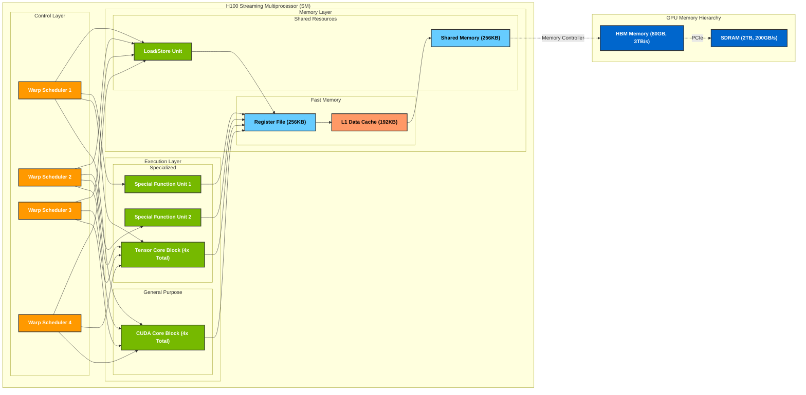

# NVIDIA H100 Streaming Multiprocessor Architecture

This diagram illustrates the internal architecture of a single Streaming Multiprocessor (SM) in the NVIDIA H100 GPU, showing the horizontal data flow and parallel processing pipeline.

## Architecture Overview

### Control Layer
- **Warp Schedulers (4x)**
  - Orchestrates thread execution
  - Issues instructions to execution units
  - Manages thread scheduling and switching
  - All schedulers have access to Load/Store Unit for memory operations

### Execution Layer
- **General Purpose Computing**
  - CUDA Core Blocks (4x)
  - Integer and floating-point operations
  - Basic arithmetic and logic operations
  - Each block contains multiple CUDA cores for parallel processing
  - Optimized for general-purpose computing tasks
  - Supports FP32, FP64, and integer operations

- **Specialized Computing**
  - Tensor Core Blocks (4x)
    - Specialized for matrix operations
    - Optimized for AI and deep learning workloads
    - Supports mixed-precision operations (FP16, BF16, FP8)
    - Performs matrix multiply-accumulate operations
    - 4x faster than FP32 for matrix operations
    - Essential for transformer models and neural networks

  - Special Function Units (2x)
    - Handle transcendental functions
    - Process special mathematical operations
    - Support for:
      - Trigonometric functions (sin, cos, tan)
      - Exponential and logarithmic functions
      - Power functions
      - Other complex mathematical operations
    - Optimized for scientific computing

### Memory Layer
- **Fast Memory**
  - Register File (256KB)
    - Fastest memory access
    - Dedicated to each thread
    - Used for frequently accessed data
    - Zero latency access

  - L1 Data Cache (192KB)
    - Shared between L1 cache and shared memory
    - Configurable split between cache and shared memory
    - Reduces memory access latency
    - Caches frequently used data

- **Shared Resources**
  - Shared Memory (256KB)
    - Low-latency memory shared between threads
    - Configurable with L1 cache
    - Used for thread communication
    - Enables efficient data sharing

  - Load/Store Unit
    - Manages memory operations
    - Handles data movement between memory levels
    - Coordinates memory access patterns
    - Optimizes memory bandwidth usage

### External Memory
- **HBM Memory**
  - 80GB capacity
  - 3TB/s bandwidth
  - High Bandwidth Memory for GPU
  - Connected via Memory Controller
  - Optimized for high-throughput data access

- **System Memory (SDRAM)**
  - CPU's main system memory
  - Typically 256GB-1TB capacity
  - Bandwidth: 100-200 GB/s (DDR4/DDR5)
  - Connected via PCIe to GPU
  - Used for CPU-GPU communication
  - Larger capacity but lower bandwidth than HBM
  - Stores data not actively being processed by GPU
  - Acts as a bridge between CPU and GPU memory systems

## Data Flow
1. Warp Schedulers dispatch instructions to execution units
2. Execution units process data using registers
3. Memory hierarchy manages data movement
4. Load/Store Unit handles memory operations for all warps
5. Shared Memory enables thread communication
6. Data flows between SM and HBM via Memory Controller
7. HBM communicates with System Memory via PCIe

## Performance Characteristics
- Up to 2048 concurrent threads per SM
- 64 thread groups (warps) of 32 threads each
- Warp switching in single clock cycle
- Efficient latency hiding through massive parallelism
- High throughput for parallel workloads
- 3TB/s memory bandwidth with HBM
- Optimized for both general-purpose and specialized computing
- Excellent performance for AI and scientific workloads 